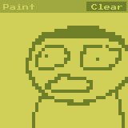

# w4-paint

A simple (12K) paint application I made in Rust while learning the [`wasm4`](https://wasm4.org/) game engine.

### Instructions

Draw pixels with left click and remove them with right click.